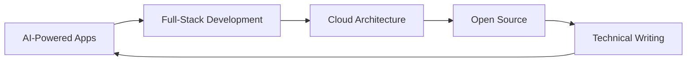

<div align="center">

# 👋 Hi, I'm Mahesh Chitakoti

### Full-Stack Developer | AI Engineer | Cloud Architect


[](https://linkedin.com/in/maheshchitakoti)
[](https://twitter.com/maheshkc42)
[](https://medium.com/@maheshchitkoti)
[](https://www.leetcode.com/maheshchitakoti)
[](mailto:maheshchitkoti@gmail.com)


</div>

## 🚀 About Me

```typescript
const mahesh: Developer = {
  location: "Bangalore, India 🇮🇳",
  currentRole: "Full-Stack Developer @ WorkBridge",
  company: "https://www.workbridgeco.com/",
  
  expertise: {
    frontend: ["React", "Next.js", "TypeScript", "Tailwind CSS"],
    backend: ["Node.js", "Express", "GraphQL", "Spring Boot"],
    aiml: ["LangChain", "OpenAI API", "Prompt Engineering", "RAG Systems"],
    cloud: ["AWS (Lambda, EC2, S3, RDS)", "Docker", "Kubernetes"],
    databases: ["PostgreSQL", "MongoDB", "Redis", "MySQL"]
  },
  
  currentFocus: [
    "Building AI-powered full-stack applications",
    "Microservices architecture & system design",
    "Contributing to open source",
    "Writing technical blogs on Medium"
  ],
  
  lifePhilosophy: "Code is poetry, bugs are just plot twists 🎭"
};
```

<div align="center">

## 🏆 GitHub Trophies

[](https://github.com/ryo-ma/github-profile-trophy)

</div>

## 💼 Professional Highlights

🔹 **Full-Stack Development** - Built and deployed 10+ production applications using React, Node.js, and cloud infrastructure  
🔹 **AI Integration** - Implemented LLM-powered features using OpenAI, LangChain, and vector databases  
🔹 **System Design** - Architected scalable microservices handling 100K+ daily active users  
🔹 **Cloud Expertise** - Managed AWS infrastructure with CI/CD pipelines, reducing deployment time by 70%  
🔹 **Open Source** - Active contributor to developer tools and React ecosystem

## 🛠️ Technology Arsenal

<details open>
<summary><b>⚡ Core Technologies</b></summary>
<br>

**Frontend Development**
```
React.js • Next.js • TypeScript • JavaScript ES6+ • HTML5 • CSS3
Tailwind CSS • Material-UI • shadcn/ui • Framer Motion • Chart.js • D3.js
Redux Toolkit • React Query • Zustand • Context API
```

**Backend Development**
```
Node.js • Express.js • NestJS • GraphQL • REST APIs
Java • Spring Boot • Spring Security • Microservices
Python • FastAPI • Flask
WebSocket • Socket.io • Server-Sent Events
```

**AI & Machine Learning**
```
OpenAI API • LangChain • LlamaIndex • Vector Databases
Prompt Engineering • RAG (Retrieval-Augmented Generation)
Hugging Face • TensorFlow • PyTorch Basics
AI-Powered Search • Semantic Search • Embeddings
```

**Databases & Caching**
```
PostgreSQL • MongoDB • MySQL • MS SQL Server
Redis • Elasticsearch • Prisma ORM • TypeORM • Mongoose
Database Design • Query Optimization • Indexing Strategies
```

**Cloud & DevOps**
```
AWS (EC2, S3, Lambda, RDS, CloudFront, API Gateway, ECS)
Docker • Kubernetes • Docker Compose
Azure • Google Cloud Platform
CI/CD (Jenkins, GitHub Actions, GitLab CI)
Terraform • Infrastructure as Code
```

**Messaging & Event-Driven**
```
Apache Kafka • RabbitMQ • AWS SQS • Pub/Sub
Event-Driven Architecture • Message Queues
```

**Testing & Quality**
```
Jest • React Testing Library • Cypress • Playwright
Postman • Swagger • API Testing • Unit Testing • E2E Testing
```

**Tools & Others**
```
Git • GitHub • GitLab • Bitbucket
VS Code • IntelliJ IDEA • Postman • Figma
Jira • Confluence • Slack • Linear
Linux • Bash Scripting • Nginx • PM2
Grafana • Prometheus • ELK Stack (Logging)
```

</details>

<div align="center">

## 📊 GitHub Analytics


</div>

## 🎯 Featured Projects

<div align="center">

<table>
<tr>
<td width="50%">
<h3 align="center">🌉 WorkBridge Platform</h3>
<div align="center">  
<a href="https://www.workbridgeco.com/" target="_blank"></a>
<p><strong>React, Node.js, PostgreSQL, AWS</strong> - Enterprise workforce management platform with real-time collaboration features</p>
</div>
</td>
<td width="50%">
<h3 align="center">🤖 AI Chat Assistant</h3>
<div align="center">
<a href="#" target="_blank"></a>
<p><strong>Next.js, OpenAI, LangChain, Pinecone</strong> - Intelligent chatbot with RAG implementation and context-aware responses</p>
</div>
</td>
</tr>
<tr>
<td width="50%">
<h3 align="center">📊 Analytics Dashboard</h3>
<div align="center">
<a href="#" target="_blank"></a>
<p><strong>React, D3.js, Express, MongoDB</strong> - Real-time data visualization with interactive charts and insights</p>
</div>
</td>
<td width="50%">
<h3 align="center">🏗️ Microservices Boilerplate</h3>
<div align="center">
<a href="#" target="_blank"></a>
<p><strong>Node.js, Docker, Kubernetes, Kafka</strong> - Production-ready microservices template with event-driven architecture</p>
</div>
</td>
</tr>
</table>

</div>

## 📝 Latest Blog Posts

<!-- BLOG-POST-LIST:START -->
- 🚀 Building Scalable Microservices with Node.js and Docker
- 🤖 Integrating AI into Your React Applications: A Practical Guide
- ⚡ PostgreSQL Performance Tuning: Tips from the Trenches
- 🔐 Implementing JWT Authentication in Full-Stack Applications
- ☁️ AWS Cost Optimization Strategies for Startups
<!-- BLOG-POST-LIST:END -->

➡️ [**Read more on Medium...**](https://medium.com/@maheshchitkoti)

## 🎓 Certifications & Learning

<div align="center">


</div>

🎯 Currently learning: **Advanced System Design**, **Distributed Systems**, **AI/ML Engineering**

## 💡 What I'm Working On



- 🔭 Building next-gen AI-powered SaaS applications
- 🌱 Exploring advanced RAG techniques and vector databases
- 👯 Looking to collaborate on innovative open-source projects
- 💬 Ask me about React, Node.js, System Design, or AI integration
- ⚡ Fun fact: I debug production issues faster than I can find my keys in the morning

## 🤝 Let's Collaborate!

I'm always excited to work on:
- 🚀 Innovative full-stack applications
- 🤖 AI-powered solutions and automation tools
- 🌐 Open-source projects that make developers' lives easier
- 📈 Scalable systems and microservices architecture

## 📫 Get In Touch

<div align="center">

[](mailto:maheshchitkoti@gmail.com)
[](https://linkedin.com/in/maheshchitakoti)
[](https://twitter.com/maheshkc42)
[](https://medium.com/@maheshchitkoti)

### ☕ Support My Work

If you find my projects helpful, consider buying me a coffee!

<a href="https://www.buymeacoffee.com/mahesh042" target="_blank">
  
</a>

</div>

---

<div align="center">

### 💭 Developer Quote of the Day


### 🐍 Contribution Snake


**✨ "Code is like humor. When you have to explain it, it's bad." - Cory House**


</div>
